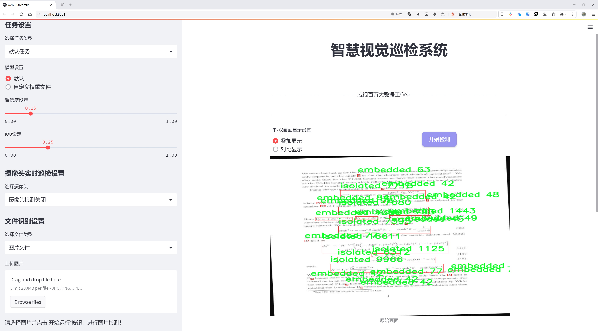
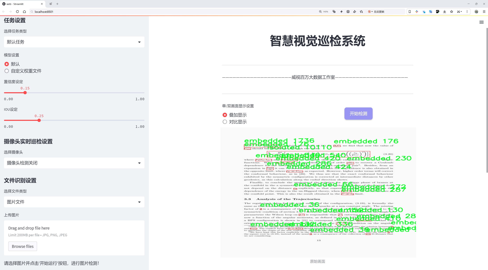
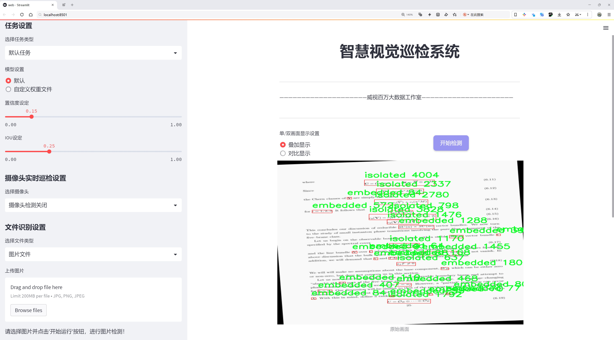
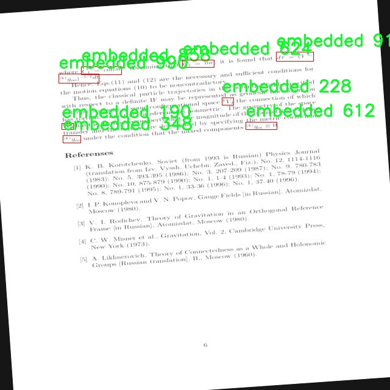
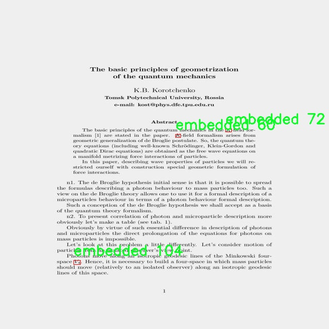
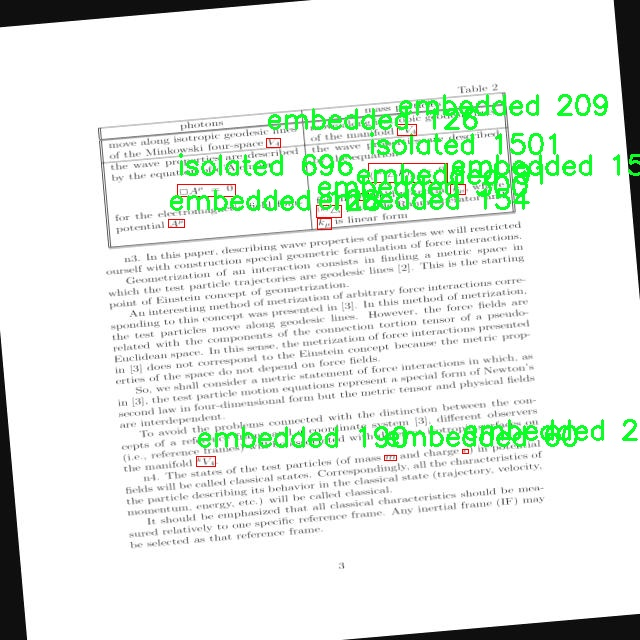
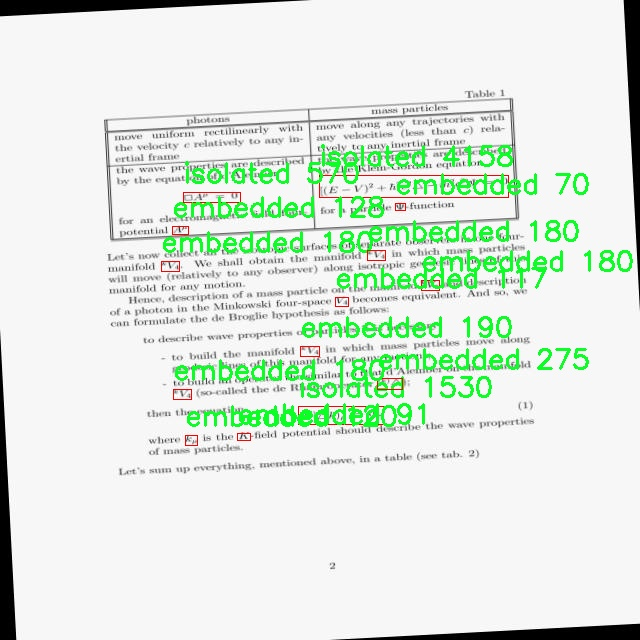

# 数学表达式检测检测系统源码分享
 # [一条龙教学YOLOV8标注好的数据集一键训练_70+全套改进创新点发刊_Web前端展示]

### 1.研究背景与意义

项目参考[AAAI Association for the Advancement of Artificial Intelligence](https://gitee.com/qunshansj/projects)

项目来源[AACV Association for the Advancement of Computer Vision](https://gitee.com/qunmasj/projects)

研究背景与意义

随着信息技术的迅猛发展，数学表达式的自动识别与处理在教育、科研及工程应用等领域的重要性日益凸显。传统的数学表达式识别方法多依赖于手工特征提取和规则匹配，难以应对复杂多变的表达式形式和多样化的书写风格。近年来，深度学习技术的快速进步为图像识别任务带来了新的机遇，尤其是目标检测领域的突破性进展，使得基于卷积神经网络（CNN）的模型在处理复杂视觉任务时展现出优越的性能。YOLO（You Only Look Once）系列模型作为目标检测的代表性算法，以其高效性和实时性广受关注，尤其是YOLOv8版本在准确性和速度上的显著提升，为数学表达式的检测提供了新的可能性。

本研究旨在基于改进的YOLOv8模型，构建一个高效的数学表达式检测系统。该系统将针对特定的数学表达式类型进行优化，特别是针对“嵌入式”和“孤立”两类表达式进行精确识别。数据集的构建是本研究的基础，包含3600幅图像，涵盖了多种书写风格和排版格式，为模型的训练和测试提供了丰富的样本。这一数据集的多样性不仅有助于提高模型的泛化能力，也为后续的应用提供了坚实的基础。

在实际应用中，数学表达式的自动识别能够显著提高教育和科研的效率。例如，在在线教育平台中，学生提交的数学作业可以通过该系统进行自动批改，教师能够更快地获取反馈，进而提升教学质量。同时，在科研领域，自动化的数学表达式识别能够加速文献分析和数据挖掘的过程，使研究人员能够更高效地获取所需信息。此外，该系统的应用还可以扩展到图书数字化、数学软件开发等多个领域，推动相关行业的智能化进程。

本研究的意义不仅在于技术层面的创新，更在于其对教育和科研实践的深远影响。通过构建基于改进YOLOv8的数学表达式检测系统，我们希望能够为数学教育的数字化转型提供有力支持，推动数学知识的传播与应用。同时，研究成果也将为后续的相关研究提供参考，促进数学表达式识别技术的进一步发展。

综上所述，基于改进YOLOv8的数学表达式检测系统的研究，既是对现有技术的挑战与创新，也是对教育和科研领域需求的积极响应。通过深入探讨和实践，我们期待能够在数学表达式的自动识别领域取得突破性进展，为相关应用场景带来切实的价值。

### 2.图片演示







##### 注意：由于此博客编辑较早，上面“2.图片演示”和“3.视频演示”展示的系统图片或者视频可能为老版本，新版本在老版本的基础上升级如下：（实际效果以升级的新版本为准）

  （1）适配了YOLOV8的“目标检测”模型和“实例分割”模型，通过加载相应的权重（.pt）文件即可自适应加载模型。

  （2）支持“图片识别”、“视频识别”、“摄像头实时识别”三种识别模式。

  （3）支持“图片识别”、“视频识别”、“摄像头实时识别”三种识别结果保存导出，解决手动导出（容易卡顿出现爆内存）存在的问题，识别完自动保存结果并导出到tempDir中。

  （4）支持Web前端系统中的标题、背景图等自定义修改，后面提供修改教程。

  另外本项目提供训练的数据集和训练教程,暂不提供权重文件（best.pt）,需要您按照教程进行训练后实现图片演示和Web前端界面演示的效果。

### 3.视频演示

[3.1 视频演示](https://www.bilibili.com/video/BV1mttQeXEAi/)

### 4.数据集信息展示

##### 4.1 本项目数据集详细数据（类别数＆类别名）

nc: 2
names: ['embedded', 'isolated']


##### 4.2 本项目数据集信息介绍

数据集信息展示

在本研究中，我们采用了名为“mathmatic_expression”的数据集，以支持对YOLOv8模型在数学表达式检测方面的改进。该数据集专门设计用于训练和评估模型在识别和分类数学表达式时的性能，尤其是在嵌入式和孤立式数学表达式的检测上。数据集包含两个主要类别，分别为“embedded”和“isolated”，这两个类别的划分旨在反映数学表达式在不同上下文中的表现形式。

“embedded”类别包含那些在文本或其他图形元素中嵌入的数学表达式。这类表达式通常与周围的文本或图像有着紧密的联系，可能会受到上下文的影响。因此，模型在处理此类数据时，需要具备较强的上下文理解能力，以便准确识别出数学符号及其结构。这种嵌入式表达式的复杂性为模型的训练和评估带来了挑战，同时也为其应用提供了广泛的可能性，尤其是在教育和科学文献自动化处理等领域。

另一方面，“isolated”类别则专注于那些独立存在的数学表达式。这类表达式通常不受其他元素的干扰，具有较为清晰的结构和边界。模型在识别这类表达式时，主要依赖于对符号的形状、大小和排列的直接分析。这种相对简单的结构使得“isolated”类别的样本在训练过程中可以作为基准，帮助模型建立对数学表达式的基本识别能力。

整个数据集的构建过程中，确保了样本的多样性和代表性，以便涵盖不同类型的数学表达式。这包括了从基础的算术运算到复杂的代数公式，甚至是微积分和线性代数中的常见表达式。每个类别的样本数量经过精心设计，以保证模型在训练时能够充分学习到每种表达式的特征，并在测试阶段展现出良好的泛化能力。

此外，数据集中的样本均经过标注，确保每个数学表达式的边界框和类别标签的准确性。这一过程不仅提高了数据集的质量，也为后续的模型训练提供了坚实的基础。标注的准确性直接影响到模型的学习效果，因此在数据集的准备阶段，我们特别重视标注团队的专业性和标注工具的选择，以确保数据集的高标准。

通过对“mathmatic_expression”数据集的深入分析和应用，我们期望能够有效提升YOLOv8在数学表达式检测中的性能。随着模型的不断训练和优化，我们相信该数据集将为未来的研究和应用提供宝贵的支持，推动数学表达式自动识别技术的发展。










### 5.全套项目环境部署视频教程（零基础手把手教学）

[5.1 环境部署教程链接（零基础手把手教学）](https://www.ixigua.com/7404473917358506534?logTag=c807d0cbc21c0ef59de5)


[5.2 安装Python虚拟环境创建和依赖库安装视频教程链接（零基础手把手教学）](https://www.ixigua.com/7404474678003106304?logTag=1f1041108cd1f708b01a)

### 6.手把手YOLOV8训练视频教程（零基础小白有手就能学会）

[6.1 手把手YOLOV8训练视频教程（零基础小白有手就能学会）](https://www.ixigua.com/7404477157818401292?logTag=d31a2dfd1983c9668658)

### 7.70+种全套YOLOV8创新点代码加载调参视频教程（一键加载写好的改进模型的配置文件）

[7.1 70+种全套YOLOV8创新点代码加载调参视频教程（一键加载写好的改进模型的配置文件）](https://www.ixigua.com/7404478314661806627?logTag=29066f8288e3f4eea3a4)

### 8.70+种全套YOLOV8创新点原理讲解（非科班也可以轻松写刊发刊，V10版本正在科研待更新）

由于篇幅限制，每个创新点的具体原理讲解就不一一展开，具体见下列网址中的创新点对应子项目的技术原理博客网址【Blog】：


[8.1 70+种全套YOLOV8创新点原理讲解链接](https://gitee.com/qunmasj/good)

### 9.系统功能展示（检测对象为举例，实际内容以本项目数据集为准）

图9.1.系统支持检测结果表格显示

  图9.2.系统支持置信度和IOU阈值手动调节

  图9.3.系统支持自定义加载权重文件best.pt(需要你通过步骤5中训练获得)

  图9.4.系统支持摄像头实时识别

  图9.5.系统支持图片识别

  图9.6.系统支持视频识别

  图9.7.系统支持识别结果文件自动保存

  图9.8.系统支持Excel导出检测结果数据


### 10.原始YOLOV8算法原理

原始YOLOv8算法原理

YOLOv8作为YOLO系列中的最新版本，继承并发展了前几代模型的核心思想，旨在提供更高效的目标检测解决方案。该算法在设计上注重速度与精度的平衡，同时具备更好的灵活性和可扩展性，以适应不同应用场景的需求。YOLOv8的架构主要由三个部分组成：输入端（Input）、主干网络（Backbone）和检测端（Head），每个部分都经过精心设计，以确保整体性能的最优化。

在YOLOv8的主干网络部分，采用了一系列卷积和反卷积层来提取特征信息。与以往版本相比，YOLOv8引入了C2f模块，这一模块在C3模块的基础上进行了改进，增加了更多的残差连接，旨在在保持网络轻量化的同时，丰富梯度信息的传递。这种设计不仅提升了特征提取的效率，还增强了模型在处理复杂场景时的鲁棒性。此外，主干网络还结合了快速空间金字塔池化（SPPF）模块，能够有效捕捉多尺度特征，进一步提升了目标检测的准确性。

在Neck部分，YOLOv8继续采用PAN-FPN结构，但对上采样部分的卷积结构进行了删减。这一变化使得特征融合过程更加高效，能够更好地整合来自不同层次的特征图，从而增强模型对不同尺度目标的检测能力。通过这种多尺度特征融合技术，YOLOv8能够在各种场景下实现更为精确的目标定位和分类，尤其是在目标尺寸差异较大的情况下，表现尤为突出。

YOLOv8的Head部分则是其创新的另一重要体现。与传统的Anchor-Based检测方法不同，YOLOv8采用了Anchor-Free的解耦合头结构，将分类和检测任务分离。这一设计不仅简化了模型的结构，还提高了推理速度，使得YOLOv8在实时检测任务中表现得更加出色。通过这种解耦合设计，YOLOv8能够在处理复杂场景时，快速而准确地识别和定位目标。

在训练过程中，YOLOv8引入了一些新的数据增强策略，例如在训练的最后10个epoch中关闭马赛克增强，并使用动态Task-Aligned Assigner样本分配策略。这些策略的引入使得模型在训练时能够更好地适应不同的样本分布，从而提升了模型的泛化能力和鲁棒性。此外，YOLOv8在损失计算方面也进行了优化，采用了BCELoss作为分类损失，DFLLoss与CIoULoss作为回归损失，这种多损失函数的组合进一步提高了模型的学习效率和准确性。

值得一提的是，YOLOv8在设计时考虑到了不同硬件环境的兼容性，提供了五种不同规模的模型（YOLOv8n、YOLOv8s、YOLOv8m、YOLOv8l和YOLOv8x），以满足不同计算资源和应用需求的场景。这种灵活的模型设置使得YOLOv8能够在移动设备、边缘计算设备以及高性能服务器上均能高效运行，极大地拓宽了其应用范围。

总的来说，YOLOv8在原始YOLO算法的基础上，通过引入新的模块、优化网络结构、改进损失计算方式以及增强训练策略，成功地提升了目标检测的性能。其在速度、精度和灵活性上的显著提升，使得YOLOv8成为当前目标检测领域中的一款先进模型，广泛应用于智能监控、自动驾驶、工业检测等多个领域。随着技术的不断进步，YOLOv8无疑将在未来的目标检测任务中发挥更为重要的作用。


### 11.项目核心源码讲解（再也不用担心看不懂代码逻辑）

#### 11.1 ui.py

以下是经过精简和注释的核心代码部分：

```python
import sys
import subprocess
from QtFusion.path import abs_path

def run_script(script_path):
    """
    使用当前 Python 环境运行指定的脚本。

    Args:
        script_path (str): 要运行的脚本路径
    """
    # 获取当前 Python 解释器的路径
    python_path = sys.executable

    # 构建运行命令，使用 streamlit 运行指定的脚本
    command = f'"{python_path}" -m streamlit run "{script_path}"'

    # 执行命令，并检查返回结果
    result = subprocess.run(command, shell=True)
    if result.returncode != 0:
        print("脚本运行出错。")

# 主程序入口
if __name__ == "__main__":
    # 获取要运行的脚本的绝对路径
    script_path = abs_path("web.py")

    # 调用函数运行脚本
    run_script(script_path)
```

### 代码注释说明：

1. **导入模块**：
   - `sys`：用于访问与 Python 解释器相关的变量和函数。
   - `subprocess`：用于执行外部命令。
   - `abs_path`：从 `QtFusion.path` 模块导入的函数，用于获取文件的绝对路径。

2. **`run_script` 函数**：
   - 该函数接收一个脚本路径作为参数，并使用当前 Python 环境运行该脚本。
   - `python_path`：获取当前 Python 解释器的路径。
   - `command`：构建一个命令字符串，用于调用 `streamlit` 运行指定的脚本。
   - `subprocess.run`：执行构建的命令，并返回执行结果。
   - 检查返回码，如果不为 0，表示脚本运行出错，打印错误信息。

3. **主程序入口**：
   - 使用 `if __name__ == "__main__":` 确保只有在直接运行该脚本时才会执行以下代码。
   - `script_path`：获取要运行的脚本 `web.py` 的绝对路径。
   - 调用 `run_script` 函数来运行指定的脚本。

这个文件名为 `ui.py`，其主要功能是通过当前的 Python 环境来运行一个指定的脚本。文件中首先导入了必要的模块，包括 `sys`、`os` 和 `subprocess`，以及一个自定义的函数 `abs_path`，这个函数可能用于获取文件的绝对路径。

在 `run_script` 函数中，首先获取当前 Python 解释器的路径，这样可以确保在正确的环境中运行脚本。接着，构建一个命令字符串，这个命令使用 `streamlit` 来运行指定的脚本。`streamlit` 是一个用于构建数据应用的库，因此这里的脚本很可能是一个用于展示数据的应用。

然后，使用 `subprocess.run` 方法来执行这个命令。`shell=True` 参数允许在 shell 中执行命令，这样可以直接使用字符串形式的命令。执行后，函数会检查返回码，如果返回码不为零，说明脚本运行出错，程序会打印出错误信息。

在文件的最后部分，使用 `if __name__ == "__main__":` 语句来确保当该文件作为主程序运行时，才会执行后面的代码。这里指定了要运行的脚本路径为 `web.py`，并调用 `run_script` 函数来执行这个脚本。

总体来说，这个文件的功能是封装了一个运行指定 Python 脚本的过程，特别是用于启动一个基于 `streamlit` 的应用。

#### 11.2 code\ultralytics\data\dataset.py

以下是经过简化并注释的核心代码部分，主要集中在 `YOLODataset` 类及其关键方法上：

```python
import numpy as np
import torch
from pathlib import Path
from ultralytics.utils import TQDM, get_hash, img2label_paths, LOGGER
from .base import BaseDataset
from .utils import save_dataset_cache_file, load_dataset_cache_file

# Ultralytics 数据集缓存版本
DATASET_CACHE_VERSION = "1.0.3"

class YOLODataset(BaseDataset):
    """
    YOLO 数据集类，用于加载 YOLO 格式的目标检测和/或分割标签。
    """

    def __init__(self, *args, data=None, task="detect", **kwargs):
        """初始化 YOLODataset，配置分割和关键点的选项。"""
        self.use_segments = task == "segment"  # 是否使用分割
        self.use_keypoints = task == "pose"  # 是否使用关键点
        self.data = data  # 数据集配置
        assert not (self.use_segments and self.use_keypoints), "不能同时使用分割和关键点。"  # 断言检查
        super().__init__(*args, **kwargs)

    def cache_labels(self, path=Path("./labels.cache")):
        """
        缓存数据集标签，检查图像并读取形状。

        Args:
            path (Path): 缓存文件保存路径 (默认: Path('./labels.cache')).
        Returns:
            (dict): 标签字典。
        """
        x = {"labels": []}  # 初始化标签字典
        nm, nf, ne, nc, msgs = 0, 0, 0, 0, []  # 统计变量：缺失、找到、空、损坏的图像数量及消息
        total = len(self.im_files)  # 图像文件总数

        # 验证图像和标签的有效性
        results = ...  # 使用多线程验证图像和标签
        pbar = TQDM(results, desc="Scanning...", total=total)  # 进度条
        for im_file, lb, shape, segments, keypoint, nm_f, nf_f, ne_f, nc_f, msg in pbar:
            nm += nm_f  # 更新缺失图像计数
            nf += nf_f  # 更新找到的图像计数
            ne += ne_f  # 更新空图像计数
            nc += nc_f  # 更新损坏图像计数
            if im_file:
                x["labels"].append(dict(
                    im_file=im_file,
                    shape=shape,
                    cls=lb[:, 0:1],  # 类别
                    bboxes=lb[:, 1:],  # 边界框
                    segments=segments,
                    keypoints=keypoint,
                    normalized=True,
                    bbox_format="xywh",
                ))
            if msg:
                msgs.append(msg)  # 收集消息
            pbar.desc = f"Scanning... {nf} images, {nm + ne} backgrounds, {nc} corrupt"
        pbar.close()

        if msgs:
            LOGGER.info("\n".join(msgs))  # 记录警告信息
        x["hash"] = get_hash(self.label_files + self.im_files)  # 生成数据集哈希
        save_dataset_cache_file(self.prefix, path, x)  # 保存缓存文件
        return x

    def get_labels(self):
        """返回 YOLO 训练所需的标签字典。"""
        self.label_files = img2label_paths(self.im_files)  # 获取标签文件路径
        cache_path = Path(self.label_files[0]).parent.with_suffix(".cache")  # 缓存文件路径

        # 尝试加载缓存文件
        try:
            cache = load_dataset_cache_file(cache_path)  # 加载缓存
            assert cache["version"] == DATASET_CACHE_VERSION  # 检查版本
            assert cache["hash"] == get_hash(self.label_files + self.im_files)  # 检查哈希
        except (FileNotFoundError, AssertionError):
            cache = self.cache_labels(cache_path)  # 如果加载失败，则缓存标签

        # 处理缓存结果
        labels = cache["labels"]  # 获取标签
        self.im_files = [lb["im_file"] for lb in labels]  # 更新图像文件列表
        return labels  # 返回标签

    def build_transforms(self, hyp=None):
        """构建并返回数据增强转换。"""
        transforms = ...  # 根据是否增强构建转换
        transforms.append(...)  # 添加格式化转换
        return transforms

    @staticmethod
    def collate_fn(batch):
        """将数据样本合并为批次。"""
        new_batch = {}
        keys = batch[0].keys()  # 获取键
        values = list(zip(*[list(b.values()) for b in batch]))  # 获取值
        for i, k in enumerate(keys):
            value = values[i]
            if k == "img":
                value = torch.stack(value, 0)  # 合并图像
            new_batch[k] = value
        return new_batch  # 返回合并后的批次
```

### 代码说明：
1. **YOLODataset 类**：用于处理 YOLO 格式的数据集，支持目标检测和分割任务。
2. **cache_labels 方法**：用于缓存标签，检查图像的有效性，并记录缺失或损坏的图像。
3. **get_labels 方法**：返回用于训练的标签，支持从缓存加载和生成新缓存。
4. **build_transforms 方法**：构建数据增强的转换操作。
5. **collate_fn 方法**：将多个样本合并为一个批次，适用于 PyTorch 的数据加载器。

这个程序文件是一个用于处理YOLO（You Only Look Once）格式数据集的Python模块，主要包含了YOLO数据集的加载、标签缓存、数据增强和批处理等功能。文件中定义了几个类，主要是`YOLODataset`和`ClassificationDataset`，以及一些辅助函数。

`YOLODataset`类是用于加载对象检测和分割标签的主要类。它的构造函数接收一些参数，如数据集的配置、任务类型等。根据任务类型，类会决定是否使用分割、关键点或方向框等信息。类中有一个`cache_labels`方法，用于缓存数据集标签，检查图像并读取其形状。这个方法会遍历图像文件和标签文件，验证它们的有效性，并将结果存储在一个字典中。它还会生成一个缓存文件，以便下次加载时可以直接使用。

`get_labels`方法用于返回YOLO训练所需的标签字典。它会尝试加载之前生成的缓存文件，如果缓存文件不存在或不匹配，则会调用`cache_labels`方法重新生成标签。此方法还会检查数据集中是否存在有效的标签，并在发现问题时发出警告。

`build_transforms`方法用于构建数据增强的转换操作。如果启用了增强，它会根据传入的超参数构建一系列的转换；否则，它会使用默认的转换。转换的最终结果会被返回。

`ClassificationDataset`类则是一个用于处理分类任务的数据集类，继承自`torchvision.datasets.ImageFolder`。它的构造函数接收数据集路径、参数设置、增强和缓存选项。类中实现了`__getitem__`和`__len__`方法，分别用于获取数据样本和返回数据集的总样本数。`verify_images`方法用于验证数据集中所有图像的有效性，并生成一个缓存文件。

此外，文件中还定义了一些辅助函数，如`load_dataset_cache_file`和`save_dataset_cache_file`，用于加载和保存数据集的缓存文件。这些函数通过使用NumPy的保存和加载功能来实现。

整体而言，这个模块提供了一个完整的框架，用于处理YOLO格式的数据集，支持对象检测、分割和分类任务，并实现了高效的标签管理和数据增强功能。

#### 11.3 70+种YOLOv8算法改进源码大全和调试加载训练教程（非必要）\ultralytics\models\yolo\__init__.py

以下是经过简化和注释后的核心代码部分：

```python
# 导入Ultralytics YOLO模型的相关功能
from ultralytics.models.yolo import classify, detect, pose, segment

# 从当前模块导入YOLO类
from .model import YOLO

# 定义该模块公开的接口，包含分类、检测、姿态估计、分割功能及YOLO类
__all__ = 'classify', 'segment', 'detect', 'pose', 'YOLO'
```

### 代码详细注释：

1. **导入YOLO模型功能**：
   ```python
   from ultralytics.models.yolo import classify, detect, pose, segment
   ```
   - 这行代码从`ultralytics.models.yolo`模块中导入了四个主要功能：
     - `classify`：用于图像分类的功能。
     - `detect`：用于目标检测的功能。
     - `pose`：用于姿态估计的功能。
     - `segment`：用于图像分割的功能。

2. **导入YOLO类**：
   ```python
   from .model import YOLO
   ```
   - 这行代码从当前模块的`model`文件中导入了`YOLO`类，`YOLO`类通常用于创建YOLO模型的实例，进行训练和推理。

3. **定义模块的公开接口**：
   ```python
   __all__ = 'classify', 'segment', 'detect', 'pose', 'YOLO'
   ```
   - `__all__`是一个特殊变量，用于定义模块的公共接口。它列出了在使用`from module import *`时，哪些名称是可以被导入的。在这里，公开了四个功能和`YOLO`类，确保用户能够方便地访问这些功能。

这个程序文件是Ultralytics YOLO（You Only Look Once）模型的一个初始化文件，文件名为`__init__.py`，它的主要作用是定义该模块的公共接口。

首先，文件开头的注释部分表明这是Ultralytics YOLO的代码，并且遵循AGPL-3.0许可证。这意味着该代码是开源的，用户可以自由使用和修改，但需要遵循相应的许可证条款。

接下来，文件通过`from`语句导入了四个功能模块：`classify`、`detect`、`pose`和`segment`。这些模块分别对应于YOLO模型的不同应用场景。具体来说，`classify`用于图像分类，`detect`用于目标检测，`pose`用于姿态估计，而`segment`则用于图像分割。这些功能模块使得YOLO模型能够处理多种计算机视觉任务。

此外，文件还导入了`YOLO`类，这个类通常是YOLO模型的核心实现，负责模型的初始化、训练和推理等功能。

最后，`__all__`变量被定义为一个元组，包含了模块中希望公开的所有名称。这意味着当用户使用`from ultralytics.models.yolo import *`时，只会导入`classify`、`segment`、`detect`、`pose`和`YOLO`这几个名称。这是一种控制模块导出内容的方式，有助于避免命名冲突和提高代码的可读性。

总体来说，这个文件是Ultralytics YOLO模型的一个重要组成部分，通过导入不同的功能模块和定义公共接口，使得用户能够方便地使用YOLO模型进行各种计算机视觉任务。

#### 11.4 70+种YOLOv8算法改进源码大全和调试加载训练教程（非必要）\ultralytics\models\yolo\detect\predict.py

以下是代码中最核心的部分，并附上详细的中文注释：

```python
from ultralytics.engine.predictor import BasePredictor
from ultralytics.engine.results import Results
from ultralytics.utils import ops

class DetectionPredictor(BasePredictor):
    """
    DetectionPredictor类，继承自BasePredictor类，用于基于检测模型进行预测。
    """

    def postprocess(self, preds, img, orig_imgs):
        """后处理预测结果，并返回Results对象的列表。"""
        
        # 使用非极大值抑制（NMS）来过滤重叠的检测框
        preds = ops.non_max_suppression(preds,
                                        self.args.conf,  # 置信度阈值
                                        self.args.iou,   # IOU阈值
                                        agnostic=self.args.agnostic_nms,  # 是否使用类别无关的NMS
                                        max_det=self.args.max_det,  # 最大检测框数量
                                        classes=self.args.classes)  # 需要检测的类别

        # 如果输入的原始图像不是列表，说明是一个torch.Tensor，需要转换为numpy数组
        if not isinstance(orig_imgs, list):
            orig_imgs = ops.convert_torch2numpy_batch(orig_imgs)

        results = []  # 初始化结果列表
        for i, pred in enumerate(preds):  # 遍历每个预测结果
            orig_img = orig_imgs[i]  # 获取对应的原始图像
            # 将预测框的坐标从缩放后的图像尺寸转换为原始图像尺寸
            pred[:, :4] = ops.scale_boxes(img.shape[2:], pred[:, :4], orig_img.shape)
            img_path = self.batch[0][i]  # 获取图像路径
            # 创建Results对象并添加到结果列表中
            results.append(Results(orig_img, path=img_path, names=self.model.names, boxes=pred))
        
        return results  # 返回处理后的结果列表
```

### 代码核心部分说明：
1. **类定义**：`DetectionPredictor`类用于处理基于YOLO模型的目标检测任务，继承自`BasePredictor`。
2. **后处理方法**：`postprocess`方法对模型的预测结果进行后处理，主要包括：
   - 使用非极大值抑制（NMS）来去除冗余的检测框。
   - 将原始图像从Torch张量转换为NumPy数组（如果需要）。
   - 将预测框的坐标从缩放后的图像尺寸转换为原始图像尺寸。
   - 创建`Results`对象以存储每个检测结果，包括原始图像、图像路径、类别名称和检测框信息。
3. **返回结果**：最终返回处理后的结果列表，便于后续使用。

这个程序文件是Ultralytics YOLO（You Only Look Once）模型的一部分，主要用于目标检测的预测功能。文件中定义了一个名为`DetectionPredictor`的类，该类继承自`BasePredictor`，用于处理基于检测模型的预测。

在这个类中，首先导入了必要的模块，包括`BasePredictor`、`Results`和一些操作工具`ops`。`DetectionPredictor`类的主要功能是对输入的图像进行目标检测，并对检测结果进行后处理。

类的文档字符串中提供了一个示例，展示了如何使用这个类进行预测。示例中，首先导入了所需的模块，然后创建了一个包含模型路径和数据源的参数字典，接着实例化了`DetectionPredictor`对象，并调用`predict_cli()`方法进行预测。

`postprocess`方法是该类的核心功能之一，负责对模型的预测结果进行后处理。它接受三个参数：`preds`（模型的预测结果）、`img`（输入图像）和`orig_imgs`（原始图像）。在方法内部，首先调用`ops.non_max_suppression`函数对预测结果进行非极大值抑制，以过滤掉重叠的检测框，保留置信度高的框。该函数的参数包括置信度阈值、IOU阈值、是否使用类无关的NMS、最大检测框数量以及需要检测的类别。

接下来，代码检查输入的原始图像是否为列表，如果不是，则将其转换为NumPy数组格式。然后，初始化一个空的结果列表，遍历每个预测结果，调整检测框的坐标，使其与原始图像的尺寸相匹配，并将结果封装为`Results`对象，包含原始图像、图像路径、模型名称和检测框信息。最后，返回结果列表。

总的来说，这个文件的主要目的是提供一个结构化的方式来进行目标检测，并对预测结果进行有效的后处理，以便后续的分析和使用。

#### 11.5 code\ultralytics\data\explorer\gui\__init__.py

以下是对给定代码的核心部分进行保留和详细注释的版本：

```python
# Ultralytics YOLO 🚀, AGPL-3.0 license

# 这是Ultralytics YOLO模型的引入，YOLO（You Only Look Once）是一种用于目标检测的深度学习模型。
# 该模型在图像中快速识别和定位物体。

# 该行代码表明该项目遵循AGPL-3.0许可证，意味着用户可以自由使用、修改和分发代码，但需要在相同许可证下共享衍生作品。
```

在这个示例中，保留了代码的核心信息，并添加了详细的中文注释，以便更好地理解代码的功能和背景。

这个文件是Ultralytics YOLO项目的一部分，文件名为`__init__.py`，它通常用于标识一个Python包。文件的开头包含了一个注释，表明该项目是Ultralytics YOLO，并且遵循AGPL-3.0许可证。

AGPL-3.0许可证是一种开源许可证，要求任何使用该软件的修改版本都必须在相同的许可证下发布。这意味着如果有人修改了Ultralytics YOLO的代码并将其分发，他们必须公开他们的源代码。

虽然这个文件的内容非常简短，仅包含了许可证信息的注释，但它在Python包中起着重要的作用。`__init__.py`文件的存在使得Python解释器能够将包含该文件的目录视为一个包，从而允许用户导入该包中的模块和功能。

总的来说，这个文件是Ultralytics YOLO项目结构的一部分，确保了该项目的开源合规性，并为其他开发者提供了使用和修改代码的法律框架。

#### 11.6 train.py

以下是经过简化和注释的核心代码部分，主要集中在 YOLO 模型的训练过程：

```python
import random
import numpy as np
import torch.nn as nn
from ultralytics.data import build_dataloader, build_yolo_dataset
from ultralytics.engine.trainer import BaseTrainer
from ultralytics.models import yolo
from ultralytics.nn.tasks import DetectionModel
from ultralytics.utils import LOGGER, RANK
from ultralytics.utils.torch_utils import de_parallel, torch_distributed_zero_first

class DetectionTrainer(BaseTrainer):
    """
    基于检测模型的训练类，继承自 BaseTrainer。
    """

    def build_dataset(self, img_path, mode="train", batch=None):
        """
        构建 YOLO 数据集。

        参数:
            img_path (str): 图像文件夹的路径。
            mode (str): 模式，可以是 'train' 或 'val'，用于自定义不同的增强。
            batch (int, optional): 批次大小，仅用于 'rect' 模式。
        """
        gs = max(int(de_parallel(self.model).stride.max() if self.model else 0), 32)
        return build_yolo_dataset(self.args, img_path, batch, self.data, mode=mode, rect=mode == "val", stride=gs)

    def get_dataloader(self, dataset_path, batch_size=16, rank=0, mode="train"):
        """构造并返回数据加载器。"""
        assert mode in ["train", "val"]
        with torch_distributed_zero_first(rank):  # 仅在 DDP 中初始化数据集 *.cache 一次
            dataset = self.build_dataset(dataset_path, mode, batch_size)
        shuffle = mode == "train"  # 训练模式下打乱数据
        workers = self.args.workers if mode == "train" else self.args.workers * 2
        return build_dataloader(dataset, batch_size, workers, shuffle, rank)  # 返回数据加载器

    def preprocess_batch(self, batch):
        """对图像批次进行预处理，包括缩放和转换为浮点数。"""
        batch["img"] = batch["img"].to(self.device, non_blocking=True).float() / 255  # 归一化到 [0, 1]
        if self.args.multi_scale:  # 如果启用多尺度
            imgs = batch["img"]
            sz = (
                random.randrange(self.args.imgsz * 0.5, self.args.imgsz * 1.5 + self.stride)
                // self.stride
                * self.stride
            )  # 随机选择图像大小
            sf = sz / max(imgs.shape[2:])  # 计算缩放因子
            if sf != 1:
                ns = [
                    math.ceil(x * sf / self.stride) * self.stride for x in imgs.shape[2:]
                ]  # 计算新的形状
                imgs = nn.functional.interpolate(imgs, size=ns, mode="bilinear", align_corners=False)  # 进行插值
            batch["img"] = imgs
        return batch

    def get_model(self, cfg=None, weights=None, verbose=True):
        """返回 YOLO 检测模型。"""
        model = DetectionModel(cfg, nc=self.data["nc"], verbose=verbose and RANK == -1)
        if weights:
            model.load(weights)  # 加载预训练权重
        return model

    def plot_training_samples(self, batch, ni):
        """绘制训练样本及其标注。"""
        plot_images(
            images=batch["img"],
            batch_idx=batch["batch_idx"],
            cls=batch["cls"].squeeze(-1),
            bboxes=batch["bboxes"],
            paths=batch["im_file"],
            fname=self.save_dir / f"train_batch{ni}.jpg",
            on_plot=self.on_plot,
        )
```

### 代码注释说明：
1. **类定义**：`DetectionTrainer` 继承自 `BaseTrainer`，用于实现 YOLO 模型的训练。
2. **`build_dataset` 方法**：根据给定的图像路径和模式构建 YOLO 数据集，支持训练和验证模式。
3. **`get_dataloader` 方法**：构造数据加载器，支持多进程和数据打乱。
4. **`preprocess_batch` 方法**：对输入的图像批次进行预处理，包括归一化和可能的多尺度调整。
5. **`get_model` 方法**：返回一个 YOLO 检测模型，并可选择加载预训练权重。
6. **`plot_training_samples` 方法**：绘制训练样本及其对应的标注，便于可视化训练过程。

以上代码片段展示了 YOLO 模型训练的核心逻辑和数据处理流程。

这个程序文件 `train.py` 是一个用于训练 YOLO（You Only Look Once）目标检测模型的脚本，继承自 `BaseTrainer` 类。它的主要功能是构建数据集、处理批次数据、设置模型属性、获取模型和验证器、记录训练进度以及绘制训练样本和指标。

在文件开头，导入了一些必要的库和模块，包括数学运算、随机数生成、深度学习相关的 PyTorch 模块以及 Ultralytics YOLO 库中的各种功能模块。

`DetectionTrainer` 类中包含多个方法。`build_dataset` 方法用于构建 YOLO 数据集，接受图像路径、模式（训练或验证）和批次大小作为参数。它使用 `build_yolo_dataset` 函数来创建数据集，并根据模式设置不同的增强方式。

`get_dataloader` 方法用于构建和返回数据加载器。它根据模式选择是否打乱数据，并在分布式训练时确保数据集只初始化一次。该方法还会根据模式设置工作线程的数量。

`preprocess_batch` 方法负责对图像批次进行预处理，包括将图像缩放到适当的大小并转换为浮点数。它还支持多尺度训练，通过随机选择图像大小来增强模型的鲁棒性。

`set_model_attributes` 方法用于设置模型的属性，包括类别数量和类别名称等。它确保模型能够正确识别数据集中定义的类别。

`get_model` 方法返回一个 YOLO 检测模型，支持加载预训练权重。`get_validator` 方法返回一个用于验证模型性能的验证器。

`label_loss_items` 方法返回一个包含训练损失项的字典，便于记录和分析训练过程中的损失情况。`progress_string` 方法则格式化输出训练进度，包括当前的轮次、GPU 内存使用情况、损失值等信息。

`plot_training_samples` 方法用于绘制训练样本及其标注，帮助可视化训练数据的质量。`plot_metrics` 方法从 CSV 文件中绘制训练指标，便于监控模型的训练效果。最后，`plot_training_labels` 方法创建一个带有标签的训练图，展示数据集中所有标注的边界框和类别信息。

整体而言，这个文件实现了 YOLO 模型训练的各个环节，从数据加载、预处理到模型训练和验证，提供了一个完整的训练框架。

### 12.系统整体结构（节选）

### 整体功能和构架概括

该项目是一个完整的YOLO（You Only Look Once）目标检测框架，旨在提供高效的模型训练、推理和评估功能。整体架构由多个模块组成，每个模块负责特定的功能，如数据处理、模型训练、预测、可视化和回调等。通过这些模块的协作，用户可以方便地加载数据集、训练模型、进行推理并监控训练过程。

主要功能包括：
- **数据集管理**：加载和处理YOLO格式的数据集，支持多种数据增强。
- **模型训练**：提供训练过程的完整实现，包括数据加载、模型初始化、损失计算和进度监控。
- **目标检测**：实现对输入图像的目标检测功能，支持后处理和结果可视化。
- **可视化工具**：绘制训练样本、损失曲线和其他指标，帮助用户理解模型的训练状态。
- **回调机制**：支持多种回调功能，如TensorBoard、Neptune等，便于记录和分析训练过程。

### 文件功能整理表

| 文件路径                                                                                              | 功能描述                                                   |
|------------------------------------------------------------------------------------------------------|----------------------------------------------------------|
| `D:\tools\20240809\code\ui.py`                                                                      | 封装运行指定的Streamlit脚本，主要用于启动数据应用。      |
| `D:\tools\20240809\code\ultralytics\data\dataset.py`                                               | 处理YOLO格式数据集，支持标签缓存、数据增强和批处理。     |
| `D:\tools\20240809\code\70+种YOLOv8算法改进源码大全和调试加载训练教程（非必要）\ultralytics\models\yolo\__init__.py` | 定义YOLO模型包的公共接口，导入不同的功能模块。           |
| `D:\tools\20240809\code\70+种YOLOv8算法改进源码大全和调试加载训练教程（非必要）\ultralytics\models\yolo\detect\predict.py` | 实现目标检测的预测功能，处理模型的输出和后处理。        |
| `D:\tools\20240809\code\code\ultralytics\data\explorer\gui\__init__.py`                           | 标识数据探索GUI模块的包，确保模块的结构。                |
| `D:\tools\20240809\code\train.py`                                                                   | 训练YOLO模型，构建数据集、处理批次数据、记录训练进度。   |
| `D:\tools\20240809\code\ultralytics\utils\callbacks\neptune.py`                                   | 集成Neptune.io，用于记录和监控训练过程的回调功能。       |
| `D:\tools\20240809\code\ultralytics\models\rtdetr\val.py`                                         | 实现RT-DETR模型的验证功能，评估模型性能。                |
| `D:\tools\20240809\code\ultralytics\utils\callbacks\wb.py`                                        | 集成Weights & Biases，用于训练过程的监控和记录。        |
| `D:\tools\20240809\code\70+种YOLOv8算法改进源码大全和调试加载训练教程（非必要）\ultralytics\models\yolo\segment\train.py` | 训练YOLO分割模型，处理图像分割任务。                     |
| `D:\tools\20240809\code\70+种YOLOv8算法改进源码大全和调试加载训练教程（非必要）\ultralytics\hub\utils.py` | 提供Hub相关的工具函数，支持模型的加载和管理。           |
| `D:\tools\20240809\code\70+种YOLOv8算法改进源码大全和调试加载训练教程（非必要）\ultralytics\utils\callbacks\tensorboard.py` | 集成TensorBoard，用于记录和可视化训练过程的回调功能。   |
| `D:\tools\20240809\code\70+种YOLOv8算法改进源码大全和调试加载训练教程（非必要）\ultralytics\models\yolo\detect\val.py` | 实现YOLO模型的验证功能，评估模型在验证集上的表现。      |

以上表格整理了每个文件的功能，便于理解项目的整体结构和各个模块的作用。

注意：由于此博客编辑较早，上面“11.项目核心源码讲解（再也不用担心看不懂代码逻辑）”中部分代码可能会优化升级，仅供参考学习，完整“训练源码”、“Web前端界面”和“70+种创新点源码”以“13.完整训练+Web前端界面+70+种创新点源码、数据集获取”的内容为准。

### 13.完整训练+Web前端界面+70+种创新点源码、数据集获取


# [下载链接：https://mbd.pub/o/bread/ZpuXlJ1t](https://mbd.pub/o/bread/ZpuXlJ1t)